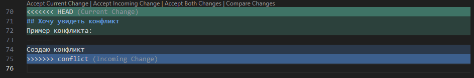

## Добавление файла к отслеживанию
Команда git add используется для добавления файлов в индекс Git. Добавьте файл в индекс с помощью команды git add <filename> или добавьте все файлы с помощью git add ..

##Фиксация изменений.
После добавления файлов в индекс вы можете сделать коммит, который зафиксирует ваши изменения. Используйте git commit -m "Commit message", чтобы сделать коммит с сообщением.

## Информация об истории коммита.
Чтобы просмотреть историю ваших коммитов, используйте команду git log. Это покажет вам автора коммита, дату и сообщение коммита.

## Сравнение с последним коммитом.
Команда git diff позволяет вам увидеть различия между вашими рабочими файлами и файлами в индексе. Это позволяет вам видеть, какие изменения вы сделали, но еще не закоммитили.

## Перемещение между сохранениями.
Команда git checkout используется для переключения между разными ветками и коммитами в вашем репозитории. Например, git checkout <branch-name> переключит вас на указанную ветку.

# Работа с Git
# Проверка наличия установленного Git

В терминале выполняем команду git version- она выводит версию программы git; если выдаёт ошибку - git не установлен

## Настройка Git

1. git config --global user.name "@$username"
2. git config --global user.email "$useremail"

Чтобы проверить, запомнил ли Git наши данные, можно ввести команду git config --list

## Инициализация Git
Чтобы инициализировать git:
"git init"

## Git status
Выводим статус текущей ветки:
"git status"

## Добавление картинок и игнорирование файлов
Чтобы добавить картинку, надо ввести " ![] () "
Для игнорирования файлов необходимо создать файл ".gitignore", затем добавить его с помощью команды `git add` и указать в файл то, что хотим игнорировать.

## Создание веток
Чтобы в Git добавить ветку мы используем:
> git branch new_branch

После данной операции ветка уже была создана, но вы по-прежнему находитесь в прежней ветке. Если вы планируете переместиться на другую ветку, в том числе только что созданную, необходимо написать checkout:
> git checkout new_branch

Чаще всего при создании новой ветки git пользователю необходимо сразу же переключиться на нее. В таком случае стоит использовать:
> git checkout branch new_branch

или:
>git checkout -b new_branch

Если пользователю нужно получить список определенного множества веток, то тогда можно воспользоваться ключами. Одними из самых распространенных будут:

> - r — при использовании этого ключа мы получим список удаленных веток,
> - a — используя этот параметр, в выводе будут удаленные и локальные ветки.

## Основы ветвления и слияния веток
>git merge

В Git предусмотрено слияние — перенос изменений с одной ветки на другую. Однако сливаемая ветка (под этим определением мы подразумеваем ветку, у которой берем изменения для «вливания» их в другую ветвь) никак не меняется и остается в прежнем состоянии. Такие преобразования мы получаем, применив git merge
Операция может привести к появлению конфликтов при попытке слить ветки. Это вызвано тем, что изменения удаляют или переписывают информацию в существующих файлах. При попытке некорректного слияния Git останавливает выполнение команды, чтобы вы могли разрешить конфликт.

Также стоит упомянуть о существовании ключей, предназначенных специально для работы с конфликтами:
>—abort — прерывает слияние и возвращает все к началу

>—continue — продолжает слияние после разрешения конфликта

Решить конфликт можно двумя способами:

Вручную разрешить файловый конфликт. Для этого нужно самим изменить файлы, с которыми возникли проблемы. Мы получим файлы такими, какими и представляли их при попытке слияния.
Выбрать более подходящий файл, а от второго отказаться.

## Решение конфликтов
Пример конфликта:

## Удаление веток
>git branch -d your_branch

Удаление веток не такой простой процесс, как может показаться. Можно случайно удалить несохраненные изменения в исходном коде, что приведет к нежелательным последствиям. Поэтому здесь нужно действовать осторожно. С операцией удаления над ветками справляется уже привычная команда git branch с параметром **-d**

Для корректного удаления нужно помнить несколько правил, чтобы не получить ошибки:

Нельзя удалить ветку, в которой вы находитесь. Git выкинет ошибку и не произведет удаление. Следовательно, нужно перейти на другую ветку.
Git не позволит удалить ветку, у которой есть несохраненные изменения. Так мы избегаем ситуации, когда часть написанного кода будет безвозвратно утеряна. Если же мы уверены, что изменения в этой версии не нужны и их можно смело удалять, то вместо флага **-d** используем **-D**:
> git branch -D your_branch

Соблюдая все условия, нам удастся удалить указанную ветвь.